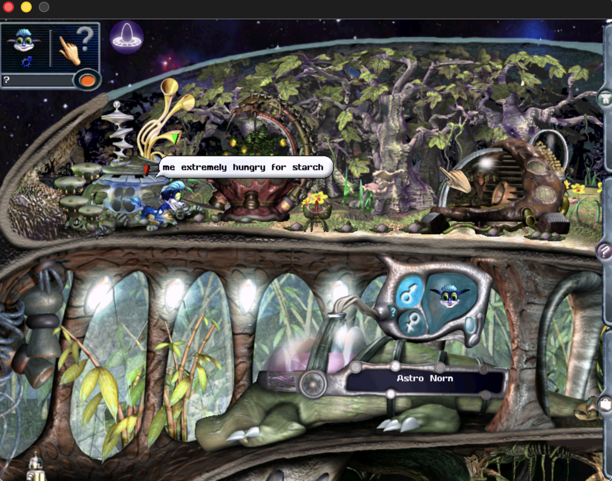
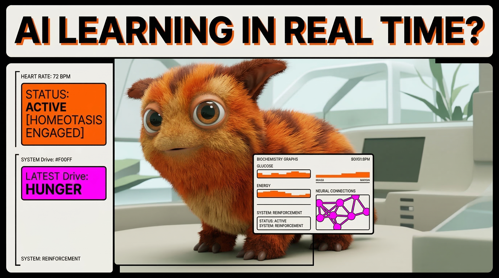

# Creatures 3 / Docking Station (macOS Port)

This repository contains a refactored version of the Creatures 3 / Docking Station engine, updated to run on modern macOS (including ARM64).



## Demo Video

[](https://www.youtube.com/watch?v=LyVzUs_rTQ4)

*Creatures 3* is a blueprint for embodied AI. While modern LLMs hit the **Embodiment Crisis**, acting like "smart amnesiacs" in the physical world, Norns learn through **Affective Learning**, driven by internal homeostasis rather than brute-force token prediction. The port demonstrated here was built on macOS using Google Antigravity IDE, showing how 1990s artificial life research offers a path toward robots that understand the thermodynamic consequences of their actions.

## What is this?

This is an **unofficial macOS port** of the Creatures 3 / Docking Station game engine. It allows the game to run natively on macOS (including Apple Silicon / ARM64), which the original release does not support.

> [!IMPORTANT]
> **This repository contains only the engine — no game data is included.** You must own a legitimate copy of *Creatures Exodus* (which bundles Creatures 3 and Docking Station) and supply the original game files yourself.

### Where to buy the game

| Store | Link |
|---|---|
| Steam | [Creatures: Docking Station + Creatures 3](https://store.steampowered.com/app/1797350/Creatures_Docking_Station__Creatures_3/) |
| GOG | [Creatures Exodus](https://www.gog.com/en/game/creatures_exodus) |

> [!NOTE]
> **Windows users do not need this port.** The game runs natively on Windows when purchased from either store above. This port is only necessary for macOS users.

## Prerequisites

- **CMake** (3.10+)
- **SDL 1.2** (or `sdl12-compat`)
- **ZLIB**

On macOS, you can install these via Homebrew:
```bash
brew install cmake sdl12-compat zlib
```

## Building

To build the project, use the following commands from the root directory:

```bash
cmake -B build
cmake --build build
```

The executable `lc2e` will be created in the `build/` directory.

## Setup

The engine reads two configuration files from the game asset directory:

### `machine.cfg`

Tells the engine where to find game assets. Paths are resolved relative to the game asset directory (i.e. relative to `Docking Station/`). The Steam version ships a `machine.cfg` with Windows absolute paths — replace it with one using relative paths:

```ini
"Auxiliary 1 Backgrounds Directory" "../Creatures 3/Backgrounds"
"Auxiliary 1 Body Data Directory" "../Creatures 3/Body Data"
"Auxiliary 1 Bootstrap Directory" "../Creatures 3/Bootstrap"
"Auxiliary 1 Catalogue Directory" "../Creatures 3/Catalogue"
"Auxiliary 1 Exported Creatures Directory" "../Creatures 3/My Creatures"
"Auxiliary 1 Genetics Directory" "../Creatures 3/Genetics"
"Auxiliary 1 Images Directory" "../Creatures 3/Images"
"Auxiliary 1 Main Directory" "../Creatures 3"
"Auxiliary 1 Overlay Data Directory" "../Creatures 3/Overlay Data"
"Auxiliary 1 Resource Files Directory" "../Creatures 3/My Agents"
"Auxiliary 1 Sounds Directory" "../Creatures 3/Sounds"
"Backgrounds Directory" Backgrounds
"Body Data Directory" "Body Data"
"Bootstrap Directory" Bootstrap
"Catalogue Directory" Catalogue
"Creature Database Directory" "Creature Galleries"
"Display Type" 2
"Exported Creatures Directory" "My Creatures"
"Game Name" "Docking Station"
"Genetics Directory" Genetics
"Images Directory" Images
"Journal Directory" Journal
"Main Directory" .
"Overlay Data Directory" "Overlay Data"
"Resource Files Directory" "My Agents"
"Sounds Directory" Sounds
"Users Directory" Users
"Win32 Auxiliary Game Name 1" "Creatures 3"
"Worlds Directory" "My Worlds"
```

The `"Auxiliary 1 ..."` entries point to the Creatures 3 directory, which must sit alongside the `Docking Station` folder (i.e. `../Creatures 3/` must exist). These entries are only needed if you own Creatures 3 in addition to Docking Station.

### `user.cfg`

Stores window geometry and display settings. Created automatically if missing; you can also copy this template:

```ini
"Default Background" DS_splash
"Default Munge" DS_music.mng
DiskSpaceCheck 33554432
DiskSpaceCheckSystem 78643200
FlightRecorderMask 33
FullScreen 0
WindowBottom 600
WindowLeft 100
WindowRight 900
WindowTop 100
```

## Running

Point the engine at your game asset directory using the `--game-dir` flag (or its short alias `-d`):

```bash
./build/lc2e --game-dir "/path/to/Docking Station"
```

**Options**

| Flag | Description |
|---|---|
| `--game-dir <path>` | Set the game asset directory |
| `-d <path>` | Alias for `--game-dir` |
| `--gamespeed <N>` | Game speed multiplier (float, default 1). E.g. `3` = 3× speed, `0.5` = half speed |
| `-s <N>` | Alias for `--gamespeed` |
| `--tools` | Start the embedded developer tools server (port 9980) |
| `--mcp` | Start the API server for AI agent access (port 9980). See [AI Agent Access](#ai-agent-access-mcp) |
| `--help`, `-h` | Print usage and exit |

> [!NOTE]
> If `--game-dir` is omitted, the engine uses the current working directory.

## Developer Tools

The engine includes a browser-based developer tools suite — an engine log monitor, interactive CAOS console, live script inspector, source-level debugger, creature brain/chemistry inspector, and a **CAOS IDE** for editing and hot-patching scripts in the running engine. The tools server is embedded directly in the `lc2e` binary with **zero external dependencies** (no Node.js, no relay scripts).

```bash
./build/lc2e -d "/path/to/Docking Station" --tools
# Open http://localhost:9980 in your browser
```


When `--tools` is not passed, the tools server does not start and there is zero overhead.

For full details see [`tools/README.md`](./tools/README.md). For the technical architecture, see [`tools/ARCHITECTURE.md`](./tools/ARCHITECTURE.md).

## AI Agent Access (MCP)

The engine supports the [Model Context Protocol (MCP)](https://modelcontextprotocol.io/), enabling AI agents to **directly interact with the running game** — executing CAOS commands, inspecting creatures, querying biochemistry and neural activity, setting breakpoints, and controlling the simulation.

```bash
# Start the engine with API access for AI agents:
./build/lc2e -d "/path/to/Docking Station" --mcp

# Install the MCP adapter (first time only):
cd mcp && npm install
```

Once connected, an AI agent has access to 15 tools including `execute_caos`, `list_creatures`, `get_creature_chemistry`, `get_creature_brain`, `pause_engine`, and more. The `--mcp` flag starts the API server without the browser UI; use `--tools` instead if you want both the browser developer tools and AI access.

For setup instructions and full tool reference, see [`mcp/README.md`](./mcp/README.md).

## Testing

The project uses [GoogleTest](https://github.com/google/googletest). Test executables are built automatically as part of the normal CMake build. The suite currently has **372 tests**.

### Running the tests

```bash
cmake --build build
cd build && ctest --output-on-failure
```

### Test layout

| Target | What it covers |
|---|---|
| `test_Vector2D` | 2-D vector maths |
| `test_FilePath` | Path string manipulation |
| `test_Maths` | Bounded arithmetic, RNG |
| `test_SimpleLexer` | Token lexer |
| `test_CreaturesArchive` | Binary serialisation (incl. named variable round-trip) |
| `test_CAOSVar` | CAOS variable tagged union |
| `test_Classifier` | Family/genus/species/event matching |
| `test_Scriptorium` | Script install / find / zap store |
| `test_Configurator` | INI-style config file handler |
| `test_Catalogue` | Localised string table (incl. OVERRIDE corruption regression) |
| `test_AgentManager` | `IAgentManager` interface |
| `test_MapHandlers` | Map CAOS handler logic (`IMap&`) |
| `test_GeneralHandlers` | General CAOS handler logic (`IWorldServices&`) |
| `test_AgentHandlers` | Agent CAOS handler logic (`IWorldServices&`) |
| `test_AppHandlers` | App CAOS handler logic (`IApp&`) |
| `test_Genome` | DNA parser: gene iteration, crossover, mutation |
| `test_PointerAgent` | Click-target resolution (prevents click-through) |
| `test_TickRate` | Game tick-rate calculation (interval scaling, sleep duration) |
| `test_V39Serialization` | v39 (DS) serialisation round-trips for `LifeEvent` and `CreatureHistory` |
| `test_CompoundAgent` | Compound part slot replacement logic (AddPart with occupied slots) |
| `test_CAOSMachineCallStack` | CALL command call stack state bundle (save/restore/copy semantics) |
| `test_StringIntGroup` | PRAY chunk binary tag parsing (int/string maps, round-trip) |

### Writing a new test

#### 1. Choose a strategy: pure logic test or DI logic-layer test

There are two patterns in use:

**A — Pure unit test**: the component under test has no engine dependencies (e.g. `Vector2D`, `Maths`). Just include the `.h`, link the `.cpp`, done.

**B — DI logic-layer test**: the component calls into a large singleton (e.g. `theApp`, `theWorld`, `theMap`). Instead of mocking the singleton, extract a narrow abstract interface (`IApp`, `IWorldServices`, `IMap`) and add a thin static `ClassName::Method(IFoo&, args…)` function in a `*_Logic.cpp` file. Tests pass a `FakeApp` / `FakeWorld` / `FakeMap` test double. Production handlers delegate to the same function:

```cpp
// MyHandlers_Logic.cpp — links into both lc2e and test_MyHandlers
void MyHandlers::DoThing(IApp& app, int x) {
    app.RequestSave(); // or whatever
}

// MyHandlers.cpp — production handler, no test dep
void MyHandlers::Command_THING(CAOSMachine& vm) {
    int x = vm.FetchIntegerRV();
    DoThing(theApp, x); // delegates
}
```

Existing interfaces: `IApp` (`engine/IApp.h`), `IWorldServices` (`engine/IWorldServices.h`), `IMap` (`engine/IMap.h`), `IAgentManager` (`engine/IAgentManager.h`).

#### 2. Create `tests/test_YourComponent.cpp`

```cpp
#include "engine/YourComponent.h"
#include <gtest/gtest.h>

TEST(YourComponentTest, DoesTheThing) {
    YourComponent c;
    EXPECT_EQ(c.DoThing(), expectedValue);
}
```

#### 3. Register the target in `tests/CMakeLists.txt`

```cmake
add_executable(test_YourComponent
  test_YourComponent.cpp
  ../engine/YourComponent.cpp          # the file under test
  ../engine/PersistentObject.cpp       # add transitive deps as needed
)
target_include_directories(test_YourComponent PRIVATE
  ${CMAKE_SOURCE_DIR} ${CMAKE_SOURCE_DIR}/common ${CMAKE_SOURCE_DIR}/engine
)
target_link_libraries(test_YourComponent PRIVATE GTest::gtest_main)
gtest_discover_tests(test_YourComponent)
```

Also add the new `*_Logic.cpp` to the `set(SRC_FILES ...)` block in `CMakeLists.txt` so `lc2e` links it too.

#### 4. Breaking the App / SDL dependency chain

Many engine files transitively include `App.h` or SDL headers. The `tests/stub_*.cpp` / `stub_*.h` files provide no-op link-seam implementations:

| Stub | Provides |
|---|---|
| `stub_AgentHandle.cpp` | `NULLHANDLE`, empty `AgentHandle` methods, minimal `App::GetZLibCompressionLevel()` |
| `stub_CreaturesArchive.cpp` | No-op `CreaturesArchive::Read/Write` primitives |
| `stub_Orderiser.cpp` | No-op `Orderiser` (used by `MacroScript` serialisation) |
| `stub_Lexer.cpp` | No-op `Lexer()` constructor (used by `Orderiser`) |
| `stub_FilePath.cpp` | Minimal `FilePath` without filesystem access |
| `stub_ErrorMessageHandler.cpp` | Silences error output |
| `stub_Catalogue.cpp` | Silences catalogue lookups |
| `stub_File.cpp` | No-op file I/O |
| `stub_GenomeDeps.cpp` | Additional `Genome.cpp` link deps |
| `stub_InputManager.cpp` | `InputManager` without `App.h` / `C2eServices.h` |
| `stub_NullWorldServices.h` | `NullWorldServices : IWorldServices` — safe no-op base for `FakeWorld` |
| `stub_FakeApp.h` | `FakeApp : IApp` — records action calls, injectable return values |

Add whichever stubs you need to your executable's source list instead of the real `.cpp`.

> [!TIP]
> If the linker reports an undefined symbol for a method you don't actually call in tests, add a one-line no-op stub for it in the nearest existing `stub_*.cpp` file rather than creating another stub file.

> [!NOTE]
> `_CAOSDEBUGGER` is defined via `target_compile_definitions` for any test that includes `Classifier.cpp` or `Scriptorium.cpp`, stripping `StreamAgentNameIfAvailable()` which calls `theCatalogue`. Don't add a `#define _CAOSDEBUGGER` in your test source — cmake handles it.

#### 5. Rebuild and run

```bash
cmake --build build
cd build && ctest --output-on-failure
```

If the build fails with new undefined symbols, run:

```bash
cmake --build build 2>&1 | grep "referenced from" | sed 's/  "//; s/", referenced.*//'
```

…to get the canonical list of missing symbols, then add stubs for them.


## Porting Notes

For details on the technical changes made during the porting process, see [README.porting](./README.porting). This codebase was refactored from the original 1999 Windows source code to support POSIX systems, address unaligned memory access on ARM64, and use modern C++ standards.

## Known Issues

### Engine Monitor

- [ ] When an ettin egg in the Desert Terrarium is about to be laid, an error occurs
```
ERR
Agent runtime error:
422482.16s
ERR
Runtime error in agent 1 1 101 script 1 1 101 9 unique id 311 Gene file not found or attempt to load into invalid slotinst setv va00 0 enum 4 3 0 doif dead = 0 addv va00 1 endi next addv va00 totl 3 4 3 slow doif va00 lt 2 gsub egg_ endi subr egg_ sndc "egg1" anim [0 1 2 3 4 5] over inst setv va00 posl setv va01 post addv va00 46 addv va01 65 new: simp 3 4 3 "greneggmask" 7 8 10 elas 10 fric 100 attr 195 bhvr 32 aero 10 accg 4 perm 60 {@}gene load targ 1 "e*" setv ov01 2 mvto va00 va01 tick 60 targ ownr pose 0 retn Mon Mar 16 15:15:00 2026 - root - 1.154
422482.16s
ERR
Action: Stop Script
```

- [ ] Runtime error in agent 1 1 99 script 1 1 99 9
```
Runtime error in agent 1 1 99 script 1 1 99 9 unique id 24801 Gene file not found or attempt to load into invalid slotdoif ov99 lt 8 inst setv va99 0 enum 4 1 0 doif gmap posx posy ne 0 and gmap posx posy ne 7 setv va99 1 endi next addv ov99 1 doif va99 ne 1 stop endi endi inst setv va00 0 enum 4 2 0 doif dead = 0 addv va00 1 endi next addv va00 totl 3 4 2 slow doif va00 lt 2 gsub egg_ endi subr egg_sndc "egg1" inst setv va00 posl setv va01 post subv va00 10 addv va01 10 new: simp 3 4 2 "greneggmask" 7 1 10 elas 10 fric 100 attr 195 bhvr 32 aero 10 accg 4 perm 60 {@}gene load targ 1 "g*" setv ov01 1 mvto va00 va01 velo -10 -5 tick 600 retn Sun Mar 8 10:10:08 2026 - root - 1.154
```
- [ ] Runtime error in agent 1 1 101 script 1 1 101 9
```
Runtime error in agent 1 1 101 script 1 1 101 9 unique id 24802 Gene file not found or attempt to load into invalid slotinst setv va00 0 enum 4 3 0 doif dead = 0 addv va00 1 endi next addv va00 totl 3 4 3 slow doif va00 lt 2 gsub egg_ endi subr egg_ sndc "egg1" anim [0 1 2 3 4 5] over inst setv va00 posl setv va01 post addv va00 46 addv va01 65 new: simp 3 4 3 "greneggmask" 7 8 10 elas 10 fric 100 attr 195 bhvr 32 aero 10 accg 4 perm 60 {@}gene load targ 1 "e*" setv ov01 2 mvto va00 va01 tick 60 targ ownr pose 0 retn Sun Mar 8 10:10:08 2026 - root - 1.154
```
- [ ] Runtime error in agent 2 21 18 script 2 21 18 9
```
Runtime error in agent 2 21 18 script 2 21 18 9 unique id 26325 Incompatible type: agent expectedlock doif carr = null and fall = 0 gsub mycommedia gsub creaturecheck doif ov00 = 0 gsub moveit endi endi subr mycommedia rtar 2 23 8 {@}seta va99 name "MyCommedia" targ ownr doif targ <> va99 setv va00 0 loop addv va00 8 part -1 alph va00 1 untl va00 >= 256 kill ownr endi retn subr creaturecheck rnge 300 inst esee 4 0 0 setv va00 1 next targ ownr doif va00 = 1 and ov00 = 0 and carr = null and fall = 0 gsub inspiration elif va00 = 0 and ov00 = 1 and carr = null and fall = 0 gsub bethyself endi retn subr moveit setv va00 rand 1 3 doif va00 = 1 doif ov40 = 1 setv ov40 0 fric 100 elif ov40 = 0 setv ov40 1 fric 40 endi endi doif ov40 = 1 doif obst left < 50 addv ov71 1 endi doif obst rght < 50 subv ov71 1 endi doif ov71 <= -10 setv ov10 -1 setv ov71 0 endi doif ov71 >= 10 setv ov10 1 setv ov71 0 endi doif ov10 = -1 setv velx rand -7 -14 elif ov10 = 1 se�
```

### Other
- [x] ~~It seems game ticks are too fast, or somehow out of sync. The game appears to be running too fast.~~ Fixed: replaced `SDL_Delay(20)` with tick-rate-aware sleep using `GetWorldTickInterval()` (50ms / 20Hz).
- [x] ~~When clicking on an agent with the hand, the click is registered with all agents within that exact position. For example, when use clicks on the rightmost question mark, which opens the world menu, and if this question mark happens to be on top of a lift button, the lift button is activated.~~ Fixed: when `Find()` identifies the topmost agent, reuse it for activation instead of doing a second `IsTouching()` lookup that could match a different overlapping agent.
- [ ] The "hand" agent (representing the user) is not able to talk by pressing Enter key.
- [ ] Sounds stop playing after few minutes. Update: after leaving the game, starting it again and loading a world makes the sounds work again - the Docking Station sounds, Creatures 3 sounds are broken.
- [ ] Music doesn't load at all.
- [ ] Creatures 3 sounds are not playing, only Docking Station sounds are playing.
- [x] ~~When a world is created, the initial option of "importing two pretrained norns" crashes the game.~~ Fixed: implemented full v39 DS archive deserialization (9 sessions). Creature import now completes successfully — skeleton is rebuilt, and the creature is relocated to a valid room position if imported DS coordinates fall outside the current map.
- [x] ~~When the "hand with question mark" is selected from the upper left side of the screen, and when the user clicks on an agent, the hand doesn't show proper naming for an agent, just some code-like text.~~ Fixed: the `Catalogue` OVERRIDE mechanism was resetting the string-ID write pointer backward, causing later catalogue files (e.g. `zz_ds_grendel_upgrade`) to overwrite `"Agent Categories"` string slots with unrelated voice data. Also implemented the `CATO` command and fixed `CATA`/`CATX` to match DS behaviour.
- [ ] Within the initial menu, when delete a world is selected, the world is not deleted.
- [ ] Within the initial menu, the menu doesn't show different images for the different types of worlds: Only Docking Station world vs Docking Station + Creatures 3 world. The symbol used for representing the worlds is the Docking Station symbol in both cases. Update: the world icons change based on which type of world was selected last. If the user creates a Creatures 3 world, all icons changes to the Creatures 3 world icon, and vice versa.
- [x] In the main menu, when Quit is clicked, the menu itself disapears, but the application window doesn't close.
- [x] ~~In Docking Station, in "Comms Room", there are no agents visible, therefore no agents are available to import.~~ Fixed: PRAY handlers used `istrstream(char*, int)` which creates streams with empty get areas on modern C++, causing all agent tag lookups to fail. Switched to `istringstream`. Also zero-initialized `ostrstream` hackbuf arrays to fix non-null-terminated `str()` results (e.g. `"Script 1f"` instead of `"Script 1"`).
- [ ] Fullscreen doesn't work.
- [ ] Camera transmition, from the "Camera" agents is not working. For example, the user should see transmission from cameras in the Docking Station's Comms Room or in the Creatures 3 Bridge. Currently, the camera view is just black.
