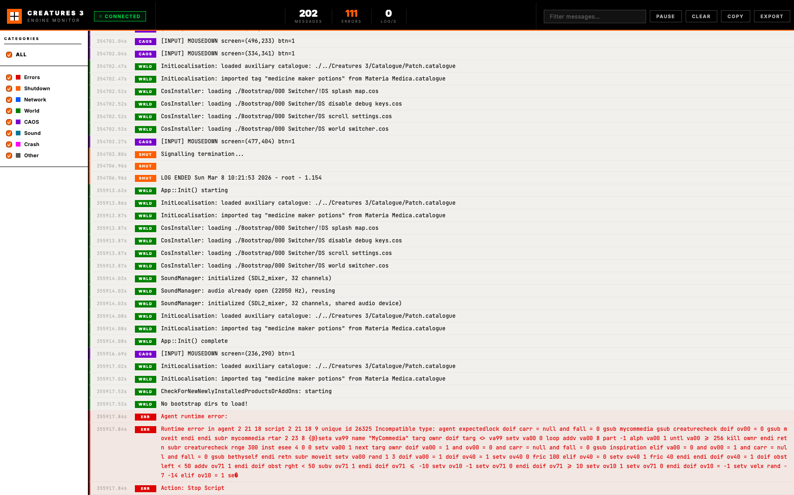

# Creatures 3 — Engine Monitor Console

A browser-based live console that streams log and error output from the Creatures 3 / Docking Station engine in real time.



## How it works

```
[C++ Engine]  ──UDP:9999──▶  [Node.js Relay]  ──WS:9998──▶  [Browser UI]
 FlightRecorder                  relay.js                     index.html
```

1. **C++ Engine** — `FlightRecorder` serialises each log/error message as a compact JSON packet (`{"t":<ms>,"cat":<mask>,"msg":"..."}`) and sends it via a non-blocking UDP socket to `127.0.0.1:9999`. This is fire-and-forget: if nothing is listening, `sendto()` silently fails and the game is unaffected.

2. **Node.js Relay** (`relay.js`) — listens for UDP packets on port 9999 and re-broadcasts each one to all connected browser clients over a WebSocket on port 9998.

3. **Browser UI** (`index.html` + `app.js`) — maintains a WebSocket connection to the relay and renders each incoming message as a colour-coded log row. Auto-reconnects if the relay restarts.

All engine errors routed through `ErrorMessageHandler::ShowErrorMessage()` (CAOS script failures, file errors, runtime exceptions, etc.) appear automatically — no manual `Log()` call sites needed for most messages.

## Starting the monitor

### One-shot (recommended)

```bash
cd /path/to/creatures3
./monitor/run.sh
```

This will:
- Install npm dependencies (`ws` package) if not already present
- Start `relay.js` in the background
- Open `index.html` in your default browser

### Manual

**Terminal 1 — relay:**
```bash
cd monitor
npm install       # first time only
node relay.js
```

**Terminal 2 — game:**
```bash
./build/lc2e
```

Then open `monitor/index.html` in any browser.

## Browser features

| Feature | Description |
|:---|:---|
| **Color-coded rows** | Errors = red, Shutdown = amber, CAOS = purple, Network = blue, etc. |
| **Live search** | Filter messages by text as you type |
| **Category sidebar** | Toggle individual log categories on/off |
| **Pause / Resume** | Freeze the stream; new messages buffer and appear on resume |
| **Export** | Download all visible messages as a `.txt` file |
| **Compact mode** | Denser layout for high-volume scenarios |
| **Auto-reconnect** | Reconnects to the relay automatically every 2 s if disconnected |

## Files

| File | Purpose |
|:---|:---|
| `relay.js` | UDP → WebSocket bridge (Node.js) |
| `index.html` | Browser console shell |
| `style.css` | Bright-Fi aesthetic (black header, off-white log area, orange/magenta accents) |
| `app.js` | WebSocket client, filtering, search, pause/resume, export |
| `run.sh` | One-shot launcher |
| `package.json` | Node.js dependencies (`ws`) |

## Ports

| Port | Protocol | Direction |
|:---|:---|:---|
| 9999 | UDP | Engine → Relay |
| 9998 | WebSocket | Relay → Browser |

Both ports are localhost-only. Change them by editing `SDL_Main.cpp` (`EnableUDPBroadcast(9999)`) and `relay.js` (`UDP_PORT` / `WS_PORT`).

## In-process crash reporter

When the engine hits a fatal signal (SIGSEGV, SIGBUS, SIGABRT, SIGILL), a signal handler in `SDL_Main.cpp` intercepts it **before** the process dies and streams the full C++ stack trace to the monitor as **CRSH** category messages.

```
Engine crashes  →  CrashSignalHandler()  →  FlightRecorder::Log(64, …)
                        ↓                        ↓
              backtrace_symbols()             UDP:9999  →  monitor shows [CRSH] rows
              abi::__cxa_demangle()
              usleep(200ms)               macOS still writes .ips crash report
              re-raise signal             (via re-raise after logging)
```

**What you see in the monitor:**

```
CRASH: signal 11 (Segmentation fault: 11)
  #0 CrashSignalHandler(int)
  #1 Map::MoveAgentInsideRoomSystem(float, float)
  #2 App::UpdateApp()
  …
```

**Implementation details:**

- A 64 KB alternate signal stack (`sigaltstack`) is installed so the handler survives stack-overflow crashes.
- `sigaction` with `SA_RESETHAND` ensures the handler fires only once and then resets to `SIG_DFL`, so the process still terminates normally and macOS generates an `.ips` crash report in `~/Library/Logs/DiagnosticReports/`.
- `usleep(200ms)` gives the OS time to send the UDP packets before the process exits.
- C++ names are demangled via `abi::__cxa_demangle()` — frames from system libraries (AppKit, CoreFoundation, dyld) remain as raw symbols since they're not C++ mangled names.

**Log category:**

| Bitmask | Label | Colour | CSS class |
|:--------|:------|:-------|:----------|
| `64` | `CRSH` | Hot pink `#ff3080` | `.cat-crash` |

To add a new category, update `FlightRecorder.h` (comment), `SDL_Main.cpp` (use the new bitmask), `app.js` (`CATEGORIES` array), `index.html` (sidebar checkbox), and `style.css` (row + label colour rules).

## Design style

The UI follows a **"Bright-Fi" / "Utopian Graphic-Core"** aesthetic — a high-contrast, clinically minimal look inspired by Swiss International typography and industrial safety signage.

### Colour palette

| Role | Value | Usage |
|:---|:---|:---|
| Base background | `#F2F0EC` warm off-white | Log area, sidebar |
| Negative space | `#000000` solid black | Header, all structural borders |
| Primary accent | `#FF5F00` hazard orange | Status indicators, active states, error counts |
| Secondary accent | `#FF00FF` cyber magenta | Crash category, pause overlay |

All borders are hard `1–2 px solid black` with **no rounded corners**, giving every panel an industrial, modular feel — as if each section could be unclipped and moved.

### Typography

- **Font**: [Inter](https://fonts.google.com/specimen/Inter) (weight 800–900 for UI labels; 400 for body)
- **Headers/labels**: ALL-CAPS with wide letter-spacing (`2–3 px`), printed in black or orange "containers"
- **Log output**: `JetBrains Mono` at 12 px for dense, readable data

### UI conventions

- Category badges are **solid-fill blocks** (not just coloured text) — one colour per category
- Error rows get a faint red tint over the white background for at-a-glance urgency
- The pause overlay uses an offset `box-shadow` for a "rubber stamp" look
- Square category dots (not circles) reinforce the geometric vocabulary