# Creatures 3 — Developer Tools

Browser-based developer tools for the Creatures 3 / Docking Station engine, served directly from the `lc2e` binary. No external dependencies — no Node.js, no relay scripts, no separate processes.

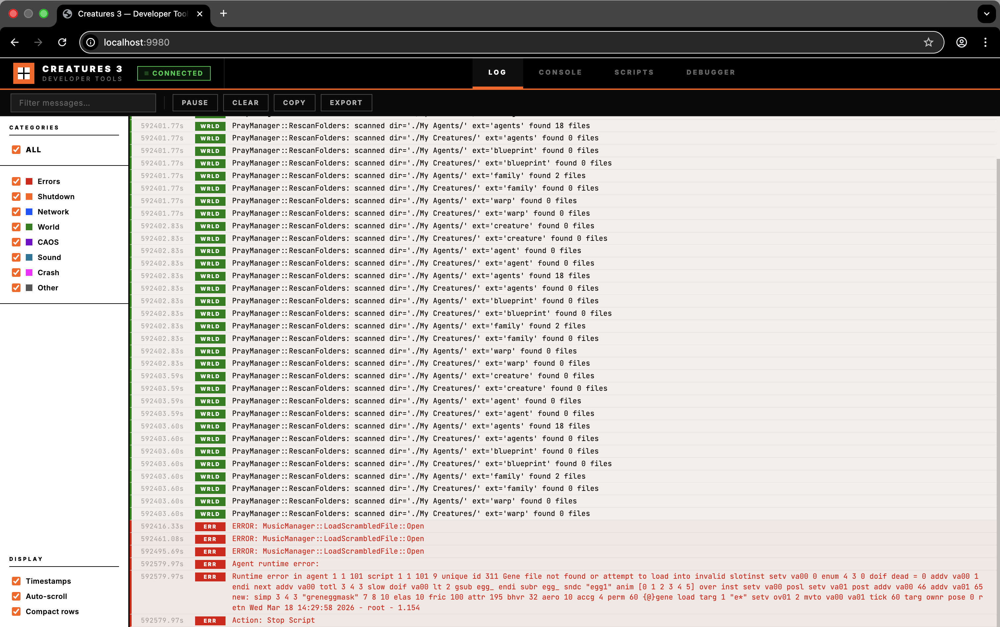

---

## Quick Start

```bash
# Start the engine with developer tools enabled
./build/lc2e -d "$HOME/Creatures Docking Station/Docking Station" --tools

# Open in your browser:
#   http://localhost:9980
```

The tools server runs on port **9980**. When `--tools` is not passed, the server does not start and there is **zero impact** on engine performance.

### CLI Options

| Flag | Description |
|---|---|
| `--tools` | Start the developer tools server on port 9980 |
| `--tools /path/to/tools` | Override the default tools directory path |

The tools directory is resolved relative to the executable: `<exe_dir>/../tools/`. If this doesn't exist, it falls back to `./tools/` relative to the current working directory. The `--tools /path` form overrides both.

---

## Tabs

The developer tools UI is organized into seven tabs, accessible from the collapsible left navigation sidebar. Each tab has a **contextual toolbar** below the header that shows only the controls relevant to the active tab.

**Engine Pause/Play:** The header includes **▶** (play) and **❚❚** (pause) buttons on the right side. These control the global engine simulation — pausing freezes all game ticks (creature AI, physics, timer scripts, agent updates) while keeping the developer tools UI and debug server fully responsive. Useful for inspecting creatures and agents in a frozen state.

### Log

The **Log** tab provides a real-time stream of engine log messages via Server-Sent Events (SSE). It replaces the old `monitor/` + `relay.js` setup with a zero-dependency embedded solution.

**Features:**

- **Live streaming** — log messages appear as the engine produces them, with sub-second latency
- **Category filtering** — toggle visibility by category using the sidebar checkboxes:
  - **Errors** (red) — runtime errors, assertion failures
  - **Shutdown** (orange) — engine shutdown sequence
  - **Network** (blue) — network/socket activity
  - **World** (green) — world loading, saving, creation
  - **CAOS** (purple) — CAOS script activity
  - **Sound** (teal) — audio system messages
  - **Crash** (magenta) — crash reports, signal handlers
  - **Other** (grey) — uncategorized messages
- **Text search** — filter messages by content using the search box
- **Pause / Resume** — temporarily stop rendering new messages; buffered messages are flushed on resume
- **Copy** — copy all visible (filtered) log lines to clipboard
- **Export** — download the entire log history as a `.txt` file
- **Display options:**
  - Timestamps — show/hide relative timestamps
  - Auto-scroll — automatically scroll to the latest message
  - Compact rows — reduce row height for denser viewing

Messages are colour-coded by category with a left border indicator and a category badge (e.g. `ERR`, `NET`, `WRLD`). Error and crash messages also have a tinted background for visibility.

### Console

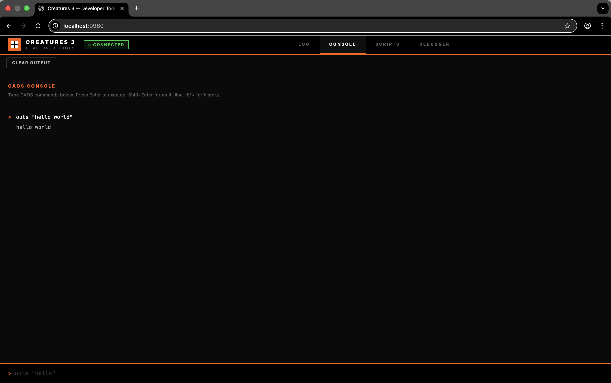

The **Console** tab is an interactive CAOS REPL (Read-Eval-Print Loop). It compiles and executes CAOS commands on the engine's main thread and displays the output immediately.

**Usage:**

```
> outs "hello world"
hello world

> outv 2 + 3
5

> setv va00 42
(ok — no output)

> outv va00
42
```

**Features:**

- **Instant execution** — commands are compiled by the `Orderiser` and executed by a fresh `CAOSMachine` on the main thread
- **Command history** — press ↑/↓ to recall previous commands (up to 200 entries)
- **Multi-line input** — press Shift+Enter for multi-line CAOS scripts; Enter alone executes
- **Error display** — compilation errors and runtime errors are shown in red with a `✗` marker
- **Clear output** — the "Clear Output" button in the header resets the console

**Limitations:**

- **No OWNR** — the console has no owner agent. Commands that require `ValidateOwner()` (e.g. `targ ownr`) will throw a runtime error. This matches the behavior of the original Windows CAOS Tool.
- **No blocking commands** — commands like `wait`, `over`, `anim ... over` will throw `sidBlockingDisallowed` because the console script runs to completion in a single call (`UpdateVM(-1)`). Use `inst` mode for enumeration loops.
- **Single execution** — each command runs in a fresh VM instance. Variables (`va00`–`va99`) do not persist between commands.

#### Advanced: C++ Stack Tracer (`CSTK`)

The engine includes a custom CAOS command `cstk` (a `StringRV`) designed for deep debugging and engine reverse-engineering. When evaluated, it returns a demangled string containing the current native C++ call stack of the CAOS Virtual Machine. 

This provides instant visibility into which C++ functions and handlers actually execute your CAOS scripts. It handles nested VM creation (e.g., inline `caos` string evaluation) flawlessly.

**Usage:**
```caos
> outs cstk
0 GeneralHandlers::StringRV_CSTK(...)
1 GeneralHandlers::Command_OUTS(...)
2 CAOSMachine::UpdateVM(int)
...
```

*Note: `cstk` is a `StringRV`, meaning it evaluates to a string and must be consumed by a command like `outs` or stored in a variable (`sets`). Executing it as a standalone command will cause a syntax error.*

### Scripts

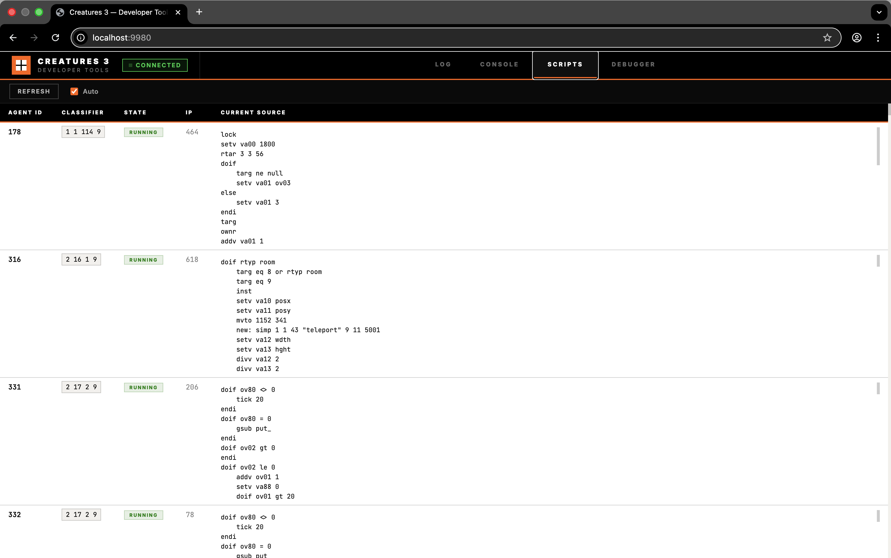

The **Scripts** tab shows a live table of all currently running CAOS scripts across all agents in the world.

**Columns:**

| Column | Description |
|---|---|
| Agent ID | The agent's unique ID (`GetUniqueID()`) |
| Classifier | Family, Genus, Species, Event with human-readable name (e.g. `2 13 100 9 (Timer)`) |
| State | `running`, `blocking` (waiting on `wait`, `over`, etc.), or `paused` (at a breakpoint) |
| IP | Current instruction pointer in the bytecode |
| Current Source | The CAOS source at the current IP, auto-formatted with line breaks and 4-space indentation |

**Features:**

- **Auto-refresh** — the table polls `GET /api/scripts` every 2 seconds by default
- **Manual refresh** — click "Refresh" for an immediate update
- **Toggle auto** — uncheck "Auto" to disable automatic polling
- **Empty state** — when no scripts are running (e.g. no world loaded), a message is shown instead of an empty table

Running scripts are shown with a green badge; blocking scripts with an orange badge; paused scripts (at a breakpoint) with an orange outlined badge tagged ⏸.

### Debugger

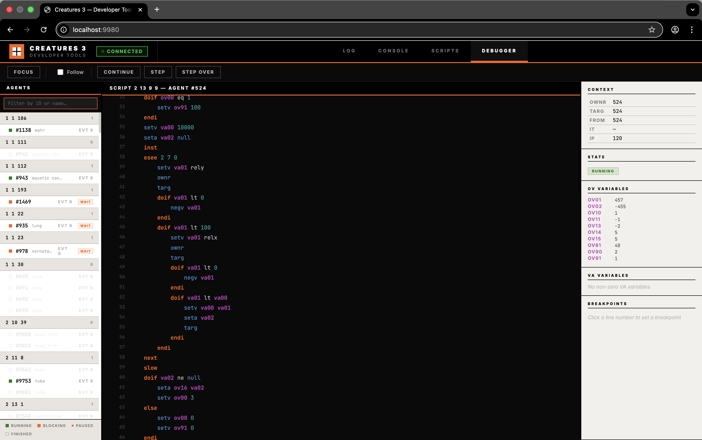

The **Debugger** tab is an interactive CAOS source-level debugger. A persistent **agent list panel** on the left shows all agents with running scripts, grouped by classifier. Select an agent to see its source code, set breakpoints, and step through execution.

**Agent List Panel:**

- **Classifier grouping** — agents are grouped by their script's Family/Genus/Species (e.g. all `2 13 9` scripts together)
- **Stable sorting** — agents within each group are sorted by ID and stay in fixed positions. Incremental DOM updates prevent flickering
- **Gallery names** — each agent shows its sprite base name (e.g. `balloonbug`, `lift`, `norn`) for quick identification
- **Event labels** — agent badges and script headers display the human-readable CAOS event name alongside the number (e.g. `evt 9 (Timer)`)
- **State dots** — colour-coded indicators: green (running), orange (blocking/waiting), orange outlined (paused at breakpoint), grey outlined (finished)
- **Stale agents** — agents whose scripts have finished are greyed out for 5 seconds before being removed
- **Search** — filter agents by ID, gallery name, or classifier using the search box
- **Creature priority** — groups containing creature agents (family 4: Norns, Grendels, Ettins) are sorted to the top
- **Legend** — a compact state dot legend at the bottom of the panel

**Source View:**

- Full CAOS source displayed with line numbers, auto-formatted with line breaks and 4-space indentation
- The current execution position is highlighted in orange
- **Follow toggle** — checkbox in the toolbar to enable/disable auto-scrolling to the current execution line. Uncheck to freely browse the source while the script runs
- **CAOS syntax highlighting** — keywords, numbers, and strings are colour-coded for readability

**Breakpoints:**

- Click any line number to toggle a breakpoint (red marker in the gutter)
- Breakpoints pause the script before executing the instruction at that source position
- All active breakpoints are listed in the inspector panel with remove buttons

**Step Controls:**

- **Continue** — resume execution until the next breakpoint or script completion
- **Step** — execute exactly one CAOS instruction and pause again (step into)
- **Step Over** — step but skip over nested blocks (loops, subroutines)

**Camera Focus:**

- **Focus** button in the toolbar moves the in-game camera to center on the selected agent's position using the `cmrp` CAOS command

**Inspector Panel:**

- **Context** — current values of OWNR, TARG, FROM, IT, and bytecode IP
- **State badge** — shows RUNNING / BLOCKING / PAUSED / FINISHED
- **OV Variables** — displays non-zero OV00–OV99 agent variables
- **VA Variables** — displays non-zero VA00–VA99 local script variables (when paused at a breakpoint)
- **Breakpoint list** — all active breakpoints with remove buttons

**Limitations:**

- Breakpoints are set on bytecode IP addresses (character offsets into the source). The mapping from source lines to IPs uses the `DebugInfo` address map built by the compiler
- Stepping operates at the bytecode instruction level, not at the CAOS source statement level
- Breakpoints are per-agent, not global

### Creatures

The **Creatures** tab is a live inspector for all creature agents (Norns, Grendels, Ettins) in the world. It provides real-time drive levels and biochemistry data for analysing creature behaviour and health.

**Layout:** Three-panel design — creature list sidebar (left), detail panel with sub-tabs (centre), summary card (right).

**Creature List:**

- All creatures in the world, listed with species icon (🐣 Norn, 🦎 Grendel, 🔧 Ettin)
- Creature name shown as primary label (if named), otherwise genus + short moniker
- Life state badge (alert, asleep, dreaming, unconscious, dead, zombie)
- Tiny health bar on each list item
- Click to select and inspect

**Drives Sub-Tab:**

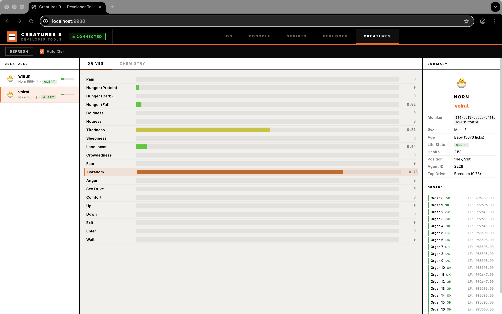

- 20 horizontal bars for all creature drives (Pain, Hunger, Tiredness, Sex Drive, etc.)
- Colour gradient: green (low) → yellow (mid) → red (high)
- Highest drive highlighted with an orange accent border
- Numeric values displayed alongside each bar

**Chemistry Sub-Tabs:**

The Chemistry inspector is split into two modes: **Monitoring** and **Syringe**.

**Monitoring:**

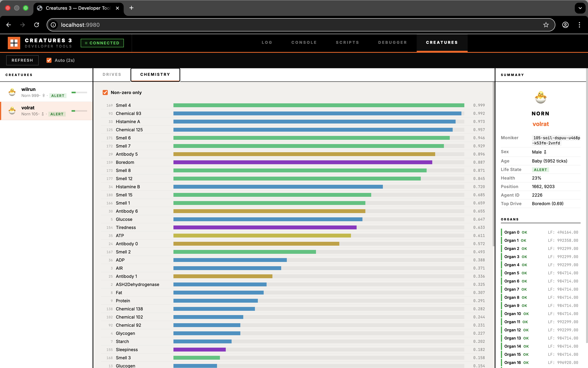

- All 256 biochemical concentrations displayed as colour-coded bars
- Sorted by value (highest first) for quick identification
- "Non-zero only" toggle to filter out inactive chemicals
- Full repository of all 256 biochemicals mapped out. This list is sourced directly from the engine's internal structure and the historical [GameWare Chemical List](https://web.archive.org/web/20110807073010/http://www.gamewaredevelopment.co.uk/cdn/C3chemicalList.php).
- Colour-coded by category: purple (drives), red (antigens), orange (antibodies), green (smells), blue (general)

**Syringe:**

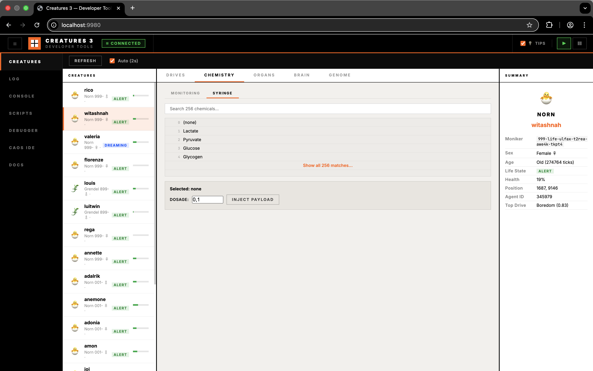

- Inject or extract specific chemicals into the creature's bloodstream on the fly
- Dynamic filtering to search through all 256 available chemicals by ID or label
- Adjustable dosage spinner spanning from -1.0 to 1.0 amounts
- Instant visual feedback and engine recalculations upon payload injection

**Organs Sub-Tab:**

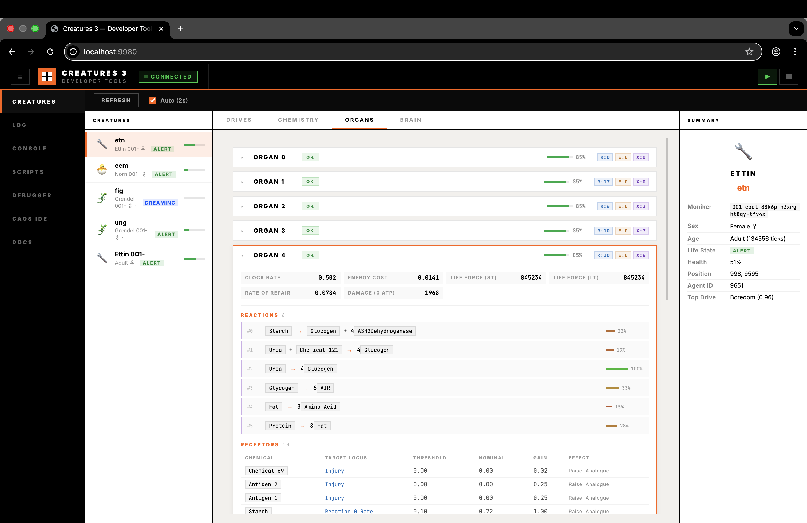

- Lists all of the creature's organs as expandable cards
- At-a-glance health bar, status badge (OK / IMPAIRED / FAILED), and component count badges (Receptors, Emitters, Reactions) for each organ
- **Click an organ card to expand it** to view internal biochemistry machinery:
  - **Stats Grid:** details such as Clock Rate, Energy Cost, Life Force, and Rate of Repair
  - **Reactions:** displays chemical formulas with proportions and visual reaction-rate bars (e.g., `Glucogen + 4 ASH2Dehydrogenase → Starch`)
  - **Receptors:** lists target locus, binding chemical, threshold, gain, and effect flags
  - **Emitters:** lists target locus, emitted chemical, threshold, gain, and tick rate

**Genome Sub-Tab:**


The Genome sub-tab is a fully immersive, real-time binary parser for inspecting the root genetics data loaded into any creature running in the engine. It maps exactly to the C++ binary structure of the `.gen` files and visually renders all 19 unique subsets across the 4 major genetic blocks.

- **Filtering Capabilities:** Quickly filter genes using the top category radio toggles (Brain, Biochemistry, Creature, Organ).
- **Text & Property Search:** Perform sub-string text searches against parameters to rapidly find elements (e.g., "Hunger" or "Chem 213").
- **Age Filter:** Isolate genes by their specific "switch-on" time (Baby, Child, Adult, Senile).
- **Intelligent Badges:** Individual gene cards present structural parameters like mutable/cuttable/duplicatable flags, gender targeting (Male/Female Only), and dormancy explicitly.
- **Biochemistry Resolution:** Automatically maps raw numeric chemical IDs into localized human-readable biological names for emitters, receptors, and reactions.
- **SVRule Translation:** Decompiles complex binary SVRule neuron setup structures out into formatted, human-readable CAOS pseudo-code for Brain Lobes and Neural Tracts.

**Summary Card:**

- Species icon and genus label
- Creature name (if assigned)
- Moniker, sex, age stage, life state, health percentage
- Position in world, agent ID
- Highest active drive
**Toolbar Controls:**

- **Refresh** — manually fetch latest data
- **Auto (2s)** — toggle automatic 2-second polling (enabled by default)

**Brain Sub-Tab:**

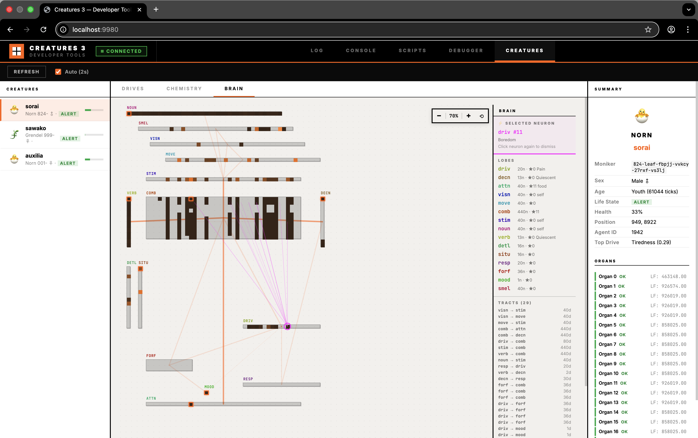

The **Brain** sub-tab provides a real-time spatial visualization of the creature's neural network, inspired by the original Creatures 3 "Brain in VAT" tool. All lobes are rendered simultaneously on a 2D canvas at their genome-defined positions, giving an immediate overview of what the creature is thinking and how information flows through its brain.

**Spatial Heatmap:**

- All lobes (typically 15 in a C3/DS brain: `noun`, `verb`, `visn`, `comb`, `decn`, `driv`, `attn`, `stim`, `move`, `detl`, `situ`, `resp`, `forf`, `mood`, `smel`) are positioned according to their genome coordinates (`x`, `y`, `width`, `height`)
- Each neuron within a lobe is a coloured cell:
  - **Dark/transparent** = inactive (activity ≈ 0). Inactive cells feature a faint inner boundary to maintain a visible cellular grid even when the entire lobe is completely dormant.
  - **Bright orange** = highly active (activity ≈ 1).
  - *Note on Noise:* To prevent low-activation Winner-Takes-All lobes from rendering completely invisible, the baseline visual noise floor of `0.07` is applied selectively (only to SV-Rule noisy lobes like `noun` and `verb`), preserving tiny fluctuations in other anatomical locations.
- The **winning neuron** (highest activation) in Winner-Takes-All (WTA) lobes (e.g., `decn`, `attn`, `comb`) is highlighted with an orange border and glow
- Lobe names are displayed above each lobe rectangle in a colour derived from the genome colour (darkened for readability)
- The background uses a subtle dot grid to help gauge distances

**Neuron Inspection:**

- **Hover** any neuron cell to see a tooltip with:
  - Lobe name and neuron ID
  - Semantic label (if known): drive names for `driv`, action names for `verb`/`decn`, category names for `noun`/`attn`/`stim`/`visn`
  - Activity level (state 0) and all non-zero SVRule state variables (S1–S7)
- **Click** a neuron to highlight it and open the **Deep Neuron Detail** panel in the sidebar, replacing the lobes list. Click again to dismiss. The detail panel includes:
  - **Identificiation**: Lobe name, neuron ID, and semantic string label
  - **State Variables**: All 8 SVRules states rendered as visual bars (orange for positive, magenta for negative)
  - **Lobe Rules**: The neuron's Lobe Initialization and Update SVRules decompiled from bytecode into human-readable CAOS pseudo-code (e.g. `load neuron[state]`)
  - **Tract Rules**: The Tract Initialization and Update SVRules for all tracts connected to this neuron
  - **Dendrite Connections**: A tabular breakdown of all incoming and outgoing connections mapped to specific peer neurons, complete with weight bars, labels, and dormant markers.
  - **Dormant anatomical pathways lines**: When clicked, dormant zero-weight anatomical pathways are also drawn across the brain map as **faint, dashed white lines**, allowing inspection of innate "blank slate" wiring before biological reinforcement.

**Tract Connection Lines:**

- Orange SVG lines connect the centres of lobes that are linked by neural tracts
- Line thickness and opacity are proportional to dendrite count — thicker lines indicate more connections
- **Hover** a tract line to see the tract name and dendrite count
- **Click** a tract line (or click a tract in the sidebar) to fetch its dendrite data and draw individual neuron-to-neuron connections as magenta lines, with opacity based on dendrite weight (heavier = more opaque). Click again to dismiss

**Info Sidebar:**

- **Lobes section** — lists all lobes with neuron count, winning neuron ID, and winning neuron label (e.g. `driv 20n · ★0 Pain` means the Pain drive has the highest output)
- **Tracts section** — lists all tracts with source/destination lobe names and dendrite count
- **Selected Tract** — when a tract is clicked, shows tract name, source → destination, total dendrite count, number of active (non-zero weight) dendrites, and maximum weight
- **Selected Neuron** — when a neuron is clicked, shows lobe name, neuron ID, and semantic label

**Zoom:**

- **Zoom controls** in the top-right corner of the viewport: **−** (zoom out), percentage display, **+** (zoom in), **⟲** (reset to 100%)
- **Ctrl+Scroll** (or ⌘+Scroll on macOS) on the viewport to zoom in/out smoothly
- Zoom range: 40% to 300%
- Zooming re-renders all lobe positions, neuron cells, and tract lines at the new scale — labels scale proportionally

**Auto-Refresh:**

- Brain overview and all lobe neuron states are polled every 2 seconds when the Brain sub-tab is visible
- Dendrite data is fetched **on-demand** only (when clicking a tract or neuron) and is not auto-polled, as tract data can be large
- Switching creatures clears the brain view and loads data for the newly selected creature

### Genetics Kit

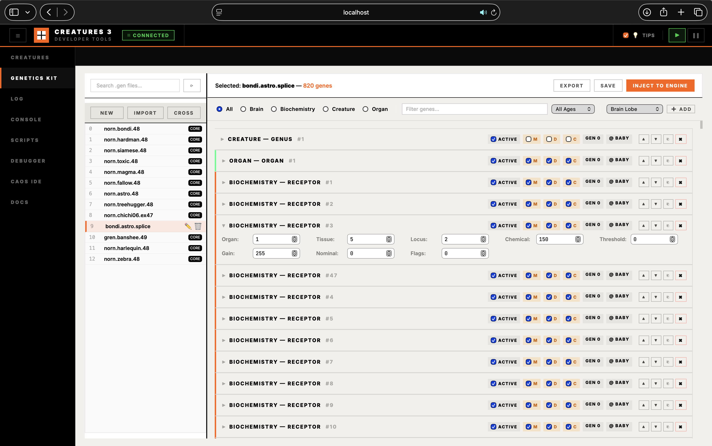

The **Genetics Kit** tab is a standalone tool for manipulating, cross-breeding, and injecting genomes directly into the engine, bypassing the normal biological reproduction cycle. Use this to instantly draft new creatures or orchestrate careful genetic crosses without waiting for in-game life cycles.

**Basic Concepts:**

- **Moniker:** Every creature and genome in the game has a unique hash called a "moniker" (e.g., `985-haze-kszy7-dqh74-qvfpg-qq7vs`). This designates the `.gen` genome file located in your game's *Genetics* directory.
- **Cross-Breeding:** Select two parent monikers from the active world or your genetics library. The engine's native crossover algorithm will shuffle their genes using proper biological inheritance and mutation to produce a unique child genome.

**Workflow & Features:**

The Genetics Kit uses a split-pane layout to maximize space: a left **Genome Library** sidebar and a right **Genetics Inspector** panel.

1. **Browse & Manage Genomes** — the left sidebar lists all `.gen` files in the world's `Genetics/` directory, acting as a full folder view. Core engine genetics are marked with a `CORE` badge. Hover over any non-core file to access inline **Rename** (✏️) and **Delete** (🗑️) actions. The sidebar also provides global actions to create a **New** genome, **Import** from JSON, or **Cross** two parent genomes.
2. **Inspect & Search** — selecting a genome loads it into the right panel. The gene table categorizes every gene in the selected genome (Brain/Biochemistry/Creature/Organ). Use the primary search filter to deeply search through the genetic literal structures (e.g., search for a specific chemical ID like `148`, or an SV-Rule property).
3. **Inline Property Editing** — all gene properties are natively editable. Structural checkboxes toggle mutability flags and activation states, while number inputs allow you to tune biochemical thresholds, brain coordinates, clock rates, and reaction values on the fly. Click **Save** in the inspector header to write changes to disk, or **Export** to download the genome as JSON.
4. **Structural Chromosome Modifiers** — full visual CRUD operations allow you to dynamically groom the DNA strand without raw byte patching. Click the action buttons on a gene to **Duplicate**, **Delete**, or **Move** it up or down the genetic ladder. You can also press **Add Gene** to create a completely blank gene of any subtype at the end of the genome.
5. **Editing Complex SV Rules** — Brain Lobe and Neural Tract genes, which rely on engine-compiled State Variable Rules for logical behavior, bypass the need for a complex compiler IDE by exposing direct **Raw Init Bytes** and **Raw Update Bytes** array editors. You can type raw bytecode arrays (0-255) seamlessly, hit Save/refresh, and view the decompiled pseudo-CAOS update dynamically.
6. **Cross** — click **Cross** in the sidebar, select two parent monikers, and provide an optional **Child Name**. The engine's native `Genome::Cross` algorithm performs biological crossover with mutation (see *Crossover Algorithm* below). A new child `.gen` file is written to the Genetics directory using your chosen name (or a safe UUID fallback).
7. **Inject** — select your preferred mode ("Inject as Hatched Creature" or "Inject as Egg") and click **Inject to Engine** in the inspector header to drop the currently loaded genome directly into the world. The API writes a temporary uniquely-identified `.gen` file, executes a conditional CAOS macro to hatch the creature or spawn an egg, and immediately auto-cleans up the temporary `.gen` file so your library remains uncluttered.

#### End-to-End Pipeline Architecture

The Genetics Kit operates through four layers:

```
┌──────────────────────┐
│  Frontend (genetics.js)  │  Browser: editing, file list, structural modifiers, crossover
├──────────────────────┤
│  REST API (DebugServer.cpp) │  HTTP endpoints: /api/genetics/*
├──────────────────────┤
│  Engine Core │  Genome class, GenomeStore, Creature constructor
├──────────────────────┤
│  CAOS VM │  NEW: SIMP → GENE LOAD → NEW: CREA → BORN → physics
└──────────────────────┘
```

1. **Frontend (`tools/genetics.js`)** — renders the file list with deep-search-driven filtering, the interactive gene property modifiers, structural chromosome tools, and the crossover modal. Communicates exclusively via `fetch()` to the REST API. State is managed in-browser (no server-side sessions).

2. **REST API (`engine/DebugServer.cpp`)** — seven endpoints handle all genetics operations. All mutating operations are dispatched to the engine's main thread via a `WorkItem` queue to ensure thread safety:
   - `GET /api/genetics/files` — scans the world's `GENETICS_DIR` for `.gen` files and detects protected core files
   - `GET /api/genetics/file/:moniker` — reads and parses a `.gen` binary file into structured JSON
   - `POST /api/genetics/crossover` — performs `Genome::Cross` and writes the child to disk
   - `POST /api/genetics/save` — serializes a (potentially modified) genome JSON back into a binary `.gen` file
   - `POST /api/genetics/rename` — safely renames a user `.gen` file (rejects if core)
   - `POST /api/genetics/delete/:moniker` — safely deletes a user `.gen` file (rejects if core)
   - `POST /api/genetics/inject` — serializes a genome, writes it, and executes the CAOS injection macro to hatch it or spawn an egg based on the requested mode

3. **Engine Core (`engine/Creature/Genome.cpp`, `GenomeStore.cpp`)** — the `Genome` class handles binary file I/O (`ReadFromFile` / `WriteToFile`), crossover (`Cross` / `CrossLoop`), and gene expression (`GetGeneType`). `GenomeStore` manages genome slots, moniker generation, and history event registration.

4. **CAOS VM** — the injection endpoint compiles and executes a multi-command CAOS script that creates a temporary agent, loads the genome, hatches the creature (or spawns the egg), sets physics properties, and places it in the world.

#### Binary `.gen` File Format

Genome files use the proprietary `dna3` binary format. The structure is:

```
┌─────────────────────────────┐
│  File Header: "dna3" (4 bytes)  │
├─────────────────────────────┤
│  Gene 1: "gene" marker + header + data │
│  Gene 2: "gene" marker + header + data │
│  ...                          │
│  Gene N: "gene" marker + header + data │
├─────────────────────────────┤
│  End Marker: "gend" (4 bytes)   │
└─────────────────────────────┘
```

**File Header:** The first 4 bytes must be `dna3` (the `DNA3TOKEN`). Files without this marker are rejected with a `genome_old_dna` error.

**Gene Markers:** Each gene begins with the 4-byte `gene` marker (`GENETOKEN`). The genome ends with the 4-byte `gend` marker (`ENDGENOMETOKEN`).

**Gene Header:** Immediately after each `gene` marker, an 8-byte header follows:

| Offset | Field | Size | Description |
|---|---|---|---|
| +4 | Type | 1 byte | Gene type: `0`=Brain, `1`=Biochemistry, `2`=Creature, `3`=Organ |
| +5 | Subtype | 1 byte | Gene subtype (e.g. Brain: `0`=Lobe, `1`=Organ, `2`=Tract) |
| +6 | ID | 1 byte | Unique gene ID (for editor tracking and crossover alignment) |
| +7 | Generation | 1 byte | Clone generation counter (incremented on gene duplication) |
| +8 | Switch-On Time | 1 byte | Life stage when gene activates (`0`=Embryo, `1`=Baby, ..., `6`=Senile) |
| +9 | Flags | 1 byte | Mutability flags bitmask (see below) |
| +10 | Mutability | 1 byte | Mutation breadth weighting (higher = more likely to mutate) |
| +11 | Variant | 1 byte | Behaviour variant (`0`=express always, `1`–`8`=specific variant only) |

**Flags bitmask:**

| Bit | Value | Name | Description |
|---|---|---|---|
| 0 | `0x01` | `MUT` | Gene allows point mutations during crossover |
| 1 | `0x02` | `DUP` | Gene may be duplicated by cutting errors |
| 2 | `0x04` | `CUT` | Gene may be deleted by cutting errors |
| 3 | `0x08` | `LINKMALE` | Gene only expressed in males |
| 4 | `0x10` | `LINKFEMALE` | Gene only expressed in females |
| 5 | `0x20` | `MIGNORE` | Gene is carried but never expressed (dormant) |

**Gene Data:** After the header, the gene-specific data follows. The data layout varies by type/subtype. A typical C3/DS genome contains ~200–350 genes across 19 distinct subtypes.

**Gene Subtypes Reference:**

| Type | Subtype | Name | Key Data Fields |
|---|---|---|---|
| 0 Brain | 0 | Lobe | 4-char name, position (x,y,w,h), colour, WTA flag, SVRules (2×48 bytes) |
| 0 Brain | 1 | Brain Organ | Clock rate, damage rate, life force, biotick, ATP coefficient |
| 0 Brain | 2 | Tract | Source/dest lobe names, neuron ranges, migration flags, SVRules (2×48 bytes) |
| 1 Biochem | 0 | Receptor | Organ/tissue/locus address, chemical, threshold, nominal, gain, effect |
| 1 Biochem | 1 | Emitter | Organ/tissue/locus address, chemical, threshold, rate, gain, flags |
| 1 Biochem | 2 | Reaction | 2 reactants + 2 products (chemical ID + proportion each), rate |
| 1 Biochem | 3 | Half-Lives | 256 bytes — natural decay rate for each chemical |
| 1 Biochem | 4 | Initial Conc. | Chemical ID + starting amount |
| 1 Biochem | 5 | Neuroemitter | 3 lobe/neuron pairs, sample rate, 4 chemical/amount pairs |
| 2 Creature | 0 | Stimulus | Stimulus ID, significance, input, intensity, 4 chemical adjustments |
| 2 Creature | 1 | Genus | Genus byte + mother moniker (32 bytes) + father moniker (32 bytes) |
| 2 Creature | 2 | Appearance | Body region, variant, species |
| 2 Creature | 3 | Pose | Pose number + 16-char pose string |
| 2 Creature | 4 | Gait | Gait number + 8 pose indices |
| 2 Creature | 5 | Instinct | 3 lobe/cell pairs, action, reinforcement chemical/amount |
| 2 Creature | 6 | Pigment | Colour channel (R/G/B) + intensity |
| 2 Creature | 7 | Pigment Bleed | Rotation + swap |
| 2 Creature | 8 | Expression | Facial expression ID, weight, 4 drive/amount pairs |
| 3 Organ | 0 | Organ | Clock rate, damage rate, life force, biotick start, ATP damage coefficient |

#### Crossover Algorithm

When the **Cross** button is clicked, the REST API reads both parent `.gen` files into `Genome` objects and calls `Genome::Cross()`. The crossover algorithm (`CrossLoop()` in `Genome.cpp`) simulates biological meiosis:

1. **Initialization** — a parent strand (`src`) is chosen randomly (50/50 mum or dad). Both parent genomes are reset to their first gene.

2. **Gene copying** — genes are copied from `src` to the child genome, one at a time, with possible mutations. The header is copied without mutation (except the switch-on time), but gene data codons may mutate:
   - **Mutation probability:** `1 / (MUTATIONRATE × (256 − Mutability) / 256 × (256 − ParentChanceOfMutation) / 256)` per codon (base rate `1/4800`)
   - **Mutation magnitude:** controlled by `ParentDegreeOfMutation` — higher values produce wider bit-flips via `pow(random, degree)` shaping

3. **Crossover points** — after copying `cross` genes (random value between 10 and `LINKAGE×2`, where `LINKAGE=50`), the algorithm attempts to swap strands. It only crosses over when both strands are synchronized (i.e., the alternate parent has a gene with the same `GeneID` as the current position). Average linkage of 50 genes means genes near each other on the "chromosome" tend to stay together in offspring.

4. **Cutting errors** — at each crossover point, there is a `1/CUTERRORRATE` (1/80) chance of a structural error:
   - **Duplication (50%)** — the gene from the previous strand is copied *again* before continuing on the new strand. The duplicated gene's generation counter is incremented. Only occurs if the gene's `DUP` flag is set.
   - **Deletion (50%)** — one gene on the new strand is skipped entirely. Only occurs if the gene's `CUT` flag is set.

5. **Termination** — when the end-of-genome marker (`gend`) is reached on the source strand, the child genome is terminated and parent monikers are written into the Genus gene header.

**Crossover parameters used by the Genetics Kit:** `MumChanceOfMutation=200`, `MumDegreeOfMutation=200`, `DadChanceOfMutation=200`, `DadDegreeOfMutation=200`. These are intentionally high to produce diverse offspring from the developer tool (the game's native breeding uses creature-specific mutation rates from biochemistry).

**Child moniker:** Since `GenomeStore::GenerateUniqueMoniker` is protected, the REST API synthesizes a moniker using `000-chld-<random hex>` format. In contrast, the engine's native moniker generation uses an MD5 hash seeded with timestamps, mouse position, world tick, agent count, and random data to guarantee universal uniqueness.

#### Injection Pipeline (CAOS Macro)

When **Inject to Engine** is clicked, the following steps execute in sequence:

**Step 1: Binary Serialization** — the frontend sends the full genome JSON (including any checkbox modifications to gene flags or active states) to `POST /api/genetics/inject`. The server re-serializes the gene array back into a `dna3` binary file. Genes with `active: false` are omitted. A fresh moniker is generated by appending `_<random>` to the input moniker, and the `.gen` file is written to the Genetics directory.

**Step 2: CAOS Execution** — the server constructs and executes a CAOS macro on the main thread. If injecting a hatched creature, the macro creates a temporary blank agent, loads the genome, and hatches it. If injecting an egg, it spawns a simple `3 4 1` agent and assigns standard egg physics and timer rules:

```caos
new: simp 1 1 1 "blnk" 1 0 0      \ Create temporary "blank" agent (family 1, genus 1, species 1)
gene load targ 1 "<moniker>"        \ Load the .gen file into genome slot 1 of the temp agent
setv va00 unid                      \ Store temp agent's unique ID in va00
new: crea 4 targ 1 0 0              \ Hatch creature from genome slot 1 (family 4 = Norn)
                                     \ Sex=0 (random), Variant=0 (random)
                                     \ → AgentManager::CreateCreature() → Creature constructor
                                     \ → body parts formed, added to creature update list
born                                 \ Register birth in HistoryStore:
                                     \   - child: LifeEvent::typeBorn
                                     \   - mum:   LifeEvent::typeChildBorn
                                     \   - dad:   LifeEvent::typeChildBorn
                                     \ Sets LifeFaculty::myProperlyBorn = true
accg game "c3_creature_accg"         \ Set gravitational acceleration (default: 5.0)
attr game "c3_creature_attr"         \ Set agent attributes (default: 198)
bhvr game "c3_creature_bhvr"         \ Set click behaviours (default: 15)
perm game "c3_creature_perm"         \ Set wall permeability (default: 100)
setv va01 unid                       \ Store new creature's unique ID in va01
targ agnt va00                       \ Re-select the temporary blank agent
kill targ                            \ Destroy the temporary agent
targ agnt va01                       \ Re-select the creature
mvsf 1000 8900                       \ Move to safe position in Norn Meso (Metaroom 11)
```

**Why the temporary agent (for creatures)?** The `GENE LOAD` CAOS command (`SubCommand_GENE_LOAD`) calls `GenomeStore::LoadEngineeredFile()`, which requires an existing agent to hold the genome slot. The temporary `blnk` agent serves as a genome carrier. When `NEW: CREA` executes, `AgentManager::CreateCreature()` reads the genome from the carrier's `GenomeStore` slot, constructs the `Creature` object (brain, biochemistry, skeleton, body parts), and adds it to the world. After hatching, the temp agent is killed. When injecting as an egg, the `new: simp` creates the egg agent directly and `gene load` targets it immediately.

**Why explicit physics properties?** The `accg`/`attr`/`bhvr`/`perm` commands read from game variables (`c3_creature_accg`, etc.) to match the physics configuration used by the DS bootstrap egg-hatching scripts in `creatureBreeding.cos`. Without these, the creature inherits default `Agent` physics (e.g., `accg=0.3`) rather than the standard creature gravity (`accg=5.0`), causing the creature to float. Similarly, the egg script applies realistic bounce (`elas`), friction (`fric`), and an incubation timer (`tick 900`).

**Step 3: History Registration** — `BORN` calls `LifeFaculty::SetProperlyBorn()`, which:
- Sets `myProperlyBorn = true` (enables tick aging)
- Creates a `LifeEvent::typeBorn` entry in the child's `CreatureHistory`
- Creates `LifeEvent::typeChildBorn` entries in both parents' histories
- This ensures the creature appears in the in-game creature tracking panel and has a correct life history

**Step 4: World Placement** — `MVSF 1000 8900` moves the creature to a safe floor position in the Docking Station Norn Meso (Metaroom 11). The `MVSF` command validates the position against the physics map and finds the nearest valid standing location.

#### Binary Serialization (Read/Write)

The REST API contains **two parallel binary codec implementations** in `DebugServer.cpp`:

1. **`parseGenomeFileToJson` (reader)** — a lambda (line ~1445) that opens the `.gen` file, validates the `dna3` header, and walks each gene sequentially. It reads the 8-byte header and then dispatches on `type/subtype` to parse the gene-specific data into JSON fields. SVRule byte arrays (48 bytes) in Brain Lobe and Tract genes are passed through `decompileSVRuleByBytes()` for human-readable display.

2. **Inject serializer (writer)** — inside the `POST /api/genetics/inject` handler (line ~1686), the server iterates the JSON gene array and re-writes each gene back to binary using `writeU8`, `writeU16BE`, and `writeFloat8` helpers. Genes with `active: false` are skipped. The file is bookended with `dna3` and `gend` markers.

> **⚠️ MAINTENANCE WARNING:** These two codecs are **manually mirrored** and must stay in exact sync with each other and with the engine's `Genome.cpp` binary format. Any change to gene data layout in the engine (e.g., adding a field to a gene subtype) must be reflected in **both** the parser and the serializer in `DebugServer.cpp`. There is no shared schema — each codec independently hard-codes the byte layout per gene subtype. Failure to keep them synchronized will produce corrupted `.gen` files or incorrect gene displays.

#### Engine Integration

This tool directly hooks into the underlying C++ `GenomeStore` and `CreatureGallery`. By operating exactly how natural births work — using the same `Genome::Cross`, `GENE LOAD`, `NEW: CREA`, and `BORN` CAOS commands that the game's own egg-hatching scripts use — injected creatures behave authentically. They appear in the built-in game UI panels (creature tracking panel), preserve full lifecycle history logging, and have correct physics properties.

### CAOS IDE

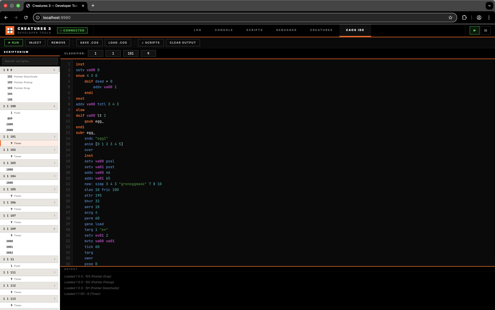

The **CAOS IDE** tab is a lightweight browser-based code editor for writing, editing, running, and managing CAOS scripts directly in the running engine. It provides a scriptorium browser, a syntax-highlighted editor, and an output console.

**Layout:** Three-panel design — scriptorium sidebar (left), code editor with classifier header (centre), output console (bottom).

**Scriptorium Browser (Left Sidebar):**

The sidebar lists all scripts currently installed in the engine's scriptorium — the central registry that holds all CAOS event scripts loaded from `.cos` bootstrap files.

- **Classifier grouping** — scripts are grouped by Family/Genus/Species (e.g. `2 18 16`)
- **Agent names** — each group header shows the human-readable agent name from the catalogue (e.g. "Tuba seed" for `2 3 16`, "Teleporter" for `1 1 152`). Classifiers without catalogue entries show just the number
- **Event labels** — each script entry shows both the event number and a human-readable name: `1` Push, `2` Pull, `9` Timer, `10` Constructor, `12` Eat, etc. (~40 standard engine events are labelled using a global dictionary; unknown events show just the number)
- **Click to load** — clicking a script entry fetches its source from the engine and loads it into the editor with syntax highlighting
- **Collapsible groups** — click a group header to collapse/expand its event list
- **Search** — filter scripts by classifier number, event number, event name, or agent name (e.g. type `teleporter` to find all Teleporter scripts, or `carrot` to find the carrot agent). Multi-word queries match all terms. Groups auto-expand when filtering
- **⟳ Scripts** — toolbar button to manually refresh the scriptorium list

**Code Editor (Centre):**

- **Syntax highlighting** — CAOS keywords, flow control (`doif`, `loop`, `scrp`, `endm`), commands (`setv`, `targ`, `mvto`), variables (`va00`–`va99`, `ov00`–`ov99`), strings, numbers, and comments are colour-coded using the shared `highlightCAOS()` tokenizer
- **Live syntax validation** — editor content is validated against the engine's compiler 500ms after typing stops. On error, a red error bar appears below the header showing the error message with line number, and the gutter highlights the offending line in red. Validation uses `POST /api/validate` which compiles without executing
- **Auto-complete** — press **Ctrl+Space** to show a dropdown of matching CAOS commands at the cursor position, or just type 3+ characters for automatic suggestions. The dropdown shows the command name, type badge (command/integer/float/string/agent/variable), parameter signature, and a brief description. Navigate with ↑↓ arrows, accept with Enter/Tab, dismiss with Escape. The command dictionary is fetched once from `GET /api/caos-commands` and cached in memory
- **Line numbers** — displayed in a gutter on the left; the error line is highlighted red when a syntax error is detected. **Click any line number to toggle a breakpoint** (see Breakpoints section below)
- **Smart indentation** — the editor behaves like a code editor:
  - **Enter** continues at the same indent level. After a block-opening keyword (`doif`, `elif`, `else`, `enum`, `esee`, `etch`, `epas`, `econ`, `loop`, `reps`, `subr`) the next line is indented one level deeper (4 spaces)
  - **Backspace** in leading whitespace snaps back to the previous tab stop (deletes to the nearest multiple of 4), not one character at a time
  - **Tab** inserts 4 spaces; **Shift+Tab** removes up to 4 leading spaces (dedent)
- **Command help (F1)** — press F1 with the cursor on any CAOS word to show a floating popup with the command name, type, parameter names, and full description. Dismiss with Escape or the ✕ button
- **No external dependencies** — custom editor using a `<textarea>` overlaid with a syntax highlighting `<pre>`, no CodeMirror or Monaco

**Classifier Header:**

Four numeric input fields (Family, Genus, Species, Event) above the editor. These are auto-populated when loading a script from the scriptorium and are used by the Inject and Remove actions.

**Toolbar Actions:**

| Button | Shortcut | Description |
|---|---|---|
| **▶ Run** | Ctrl/⌘+Enter | Executes the editor content as CAOS code via `/api/execute`. Output and errors appear in the output panel. Runs in a fresh VM with no owner agent |
| **Inject** | — | Compiles the editor content and installs it in the scriptorium under the classifier specified in the header fields. Uses the dedicated `/api/scriptorium/inject` endpoint. Strips any existing `scrp`/`endm` wrapper automatically |
| **Remove** | — | Removes the script matching the classifier fields from the scriptorium using `rscr` |
| **Save .cos** | — | Downloads the editor content as a `.cos` file. If a scriptorium script is loaded, the filename reflects the classifier (e.g. `2_18_16_9.cos`) |
| **Load .cos** | — | Opens a file picker to load a `.cos`, `.txt`, or `.caos` file into the editor |
| **⟳ Scripts** | — | Refreshes the scriptorium sidebar |
| **Clear Output** | — | Clears the output panel |

**Output Console (Bottom):**

- Displays execution results from Run, status messages from Inject/Remove/Save/Load, and error messages
- Colour-coded: green `▶` prompt for commands, white for results, red `✗` for errors, muted italic for info messages

**Breakpoints (IDE → Debugger Workflow):**

The CAOS IDE allows you to set breakpoints on source lines, then **choose which running agents** should pause at those breakpoints. This bridges the IDE (which works with scripts) and the Debugger (which works with agents).

- **Setting a breakpoint** — click any line number in the gutter. A red dot marker appears next to the line number, and the **Breakpoint Panel** opens below the classifier header
- **Breakpoint Panel** — shows all active breakpoints with:
  - Line number and bytecoded IP address
  - **Agent tags** — clickable tags for each agent currently running the same script (matching Family/Genus/Species/Event). Click a tag to toggle whether that agent should pause at the breakpoint:
    - **Orange tag** = breakpoint is active on this agent
    - **Grey tag** = breakpoint is not set on this agent
  - **Remove (×)** — removes an individual breakpoint
  - **"Clear All"** — removes all breakpoints
  - **Count** — shows `N bp · M/T agents` (N breakpoints, M bound out of T running agents)
- **No agents running** — if no agents are currently executing the script, the panel shows "no agents running". The breakpoints remain as visual markers and can be bound to agents later when they start running the script
- **Agent discovery** — the panel polls `GET /api/scripts` every 3 seconds to refresh the list of running agents. New agents that start running the script will appear as new tags
- **Breakpoints auto-clear on edit** — when the source text is modified, all breakpoints are cleared because the bytecoded address map becomes invalid

**Typical debugging workflow:**

1. **Load a script** from the scriptorium sidebar (e.g. `3 3 25` event `9` — a timer script)
2. **Click a line number** to set a breakpoint (red dot appears)
3. **Check the Scripts tab** to see which agents are running this script
4. In the **Breakpoint Panel**, click the agent tag(s) you want to debug — they turn orange
5. **Switch to the Debugger tab** — the selected agent(s) will pause at the breakpoint
6. Use **Step / Step Over / Continue** in the Debugger to inspect execution

**Technical detail:** Breakpoints use source character offsets as the coordinate system. When you click line N in the IDE, the engine compiles the editor text via `POST /api/compile-map` to verify which lines have bytecoded instructions, then sends the line's character offset via `POST /api/breakpoint` to the agent's VM. The Debugger tab uses the same coordinate system, so breakpoints set in the IDE appear at the correct line in the Debugger.

**Limitations:**

- **Run** behaves like the Console tab — no OWNR, no blocking commands, single-shot execution
- **Inject** requires the classifier fields to be set. If all four are zero, it shows an error
- **Source availability** — scripts compiled without debug info (e.g. from binary-only worlds) may report "No source available" when loaded
- **Script locking** — if a scriptorium script is currently being executed by an agent, Inject will fail with "script may be locked"
- **Auto-complete positioning** — the dropdown uses approximate font metrics; on non-standard zoom levels the position may drift slightly
- **Breakpoints are not persistent** — breakpoints are cleared when the source text is edited, when a new script is loaded, or when the page is refreshed. They exist only in the browser session
- **Blank-line breakpoints** — clicking a line with no CAOS instructions (blank line, comment-only line) shows an info message and does not set a breakpoint

### Docs (Architecture Graph)

The **Docs** tab displays an interactive, fully client-side architecture node graph of the primary C++ engine classes utilizing an SVG overlay system on a 2D DOM pane.

**Features:**
- **Drag & Drop:** You can click and drag class container nodes to dynamically restructure the spatial view at any time.
- **Auto-routing connections:** Edges reroute instantaneously linking related system objects regardless of structure. Solid lines reflect strong inheritance / ownership properties while dashed represent loosely coupled spans / dependencies.
- **Node Highlight:** You can hover edge paths, which will visually highlight the associated connecting classes in a bright orange tint. 
- **Zoom / Pan Constraints:** Includes full spatial zooming with independent control bindings (`+`, `-`, and viewport Ctrl+Scroll wheel integrations). Reset easily back to 100% bounds using the toolbar reset module.
- **Class Context:** Side panel reflects the class description, purpose and system alignment layer when any node is clicked globally.  

---

## API Reference

All API endpoints are served on port 9980 alongside the static files. Endpoints that modify engine state are executed on the main thread via a work queue (see [ARCHITECTURE.md](./ARCHITECTURE.md)).

### `POST /api/execute`

Compile and execute CAOS code. The code runs on the main thread in a fresh `CAOSMachine` with no owner agent.

**Request:**
```json
{ "caos": "outs \"hello\"" }
```

**Response:**
```json
{
  "ok": true,
  "output": "hello",
  "error": ""
}
```

On error (compilation or runtime):
```json
{
  "ok": false,
  "output": "",
  "error": "Invalid command 'foo'"
}
```

**Timeout:** 10 seconds. Returns HTTP 504 if the main thread doesn't process the request in time.

### `GET /api/scripts`

List all currently running CAOS scripts across all agents.

**Response:**
```json
[
  {
    "agentId": 42,
    "family": 2,
    "genus": 13,
    "species": 100,
    "event": 9,
    "state": "running",
    "ip": 156,
    "source": "doif targ <> null",
    "gallery": "balloonbug",
    "agentFamily": 2
  }
]
```

### `GET /api/scriptorium`

List all installed scripts in the scriptorium (the engine's script registry).

**Response:**
```json
[
  { "family": 2, "genus": 13, "species": 100, "event": 9 },
  { "family": 1, "genus": 2, "species": 14, "event": 3 }
]
```

### `GET /api/scriptorium/:f/:g/:s/:e`

Get the source code of a specific scriptorium script by classifier.

**Response (success):**
```json
{ "source": "setv va00 42\noutv va00" }
```

**Response (not found):**
```json
{ "error": "Script not found" }
```

**Timeout:** 5 seconds.

### `POST /api/scriptorium/inject`

Compile CAOS source and install it in the scriptorium under the given classifier. The source should be the script body **without** the `scrp`/`endm` wrapper.

**Request:**
```json
{
  "family": 2,
  "genus": 18,
  "species": 16,
  "event": 9,
  "source": "setv va00 42\noutv va00"
}
```

**Response (success):**
```json
{ "ok": true }
```

**Response (error):**
```json
{ "ok": false, "error": "Failed to install — script may be locked" }
```

**Timeout:** 10 seconds. Uses `Orderiser::OrderFromCAOS()` to compile, `MacroScript::SetClassifier()` to assign the classifier, and `Scriptorium::InstallScript()` to register it.

### `GET /api/agent-names`

Get human-readable agent names for all classifiers in the scriptorium, resolved from `"Agent Help F G S"` catalogue tags.

**Response:**
```json
{
  "2 3 16": "Tuba seed",
  "1 1 152": "Teleporter",
  "2 21 18": "Commedia"
}
```

Keys are `"family genus species"` strings. Only classifiers with matching catalogue entries are included.

**Timeout:** 5 seconds.

### `POST /api/validate`

Compile CAOS code without executing it. Returns success or error details. Used by the IDE for live syntax error highlighting.

**Request:** `Content-Type: application/json`
```json
{ "caos": "setv va00 42\noutv va00" }
```

**Response (ok):**
```json
{ "ok": true }
```

**Response (error):**
```json
{ "ok": false, "error": "Invalid command", "position": 24 }
```

The `position` field is the character offset within the source text (0-indexed), or -1 if unavailable. The IDE maps this to a line number for gutter highlighting.

**Timeout:** 5 seconds. Uses `Orderiser::OrderFromCAOS()` and discards the compiled script.

### `POST /api/compile-map`

Compile CAOS code and return the bytecoded address → source position map. Used by the IDE to determine which source lines have executable instructions and to map line numbers to bytecoded IPs for breakpoint display.

**Request:** `Content-Type: application/json`
```json
{ "caos": "setv va00 42\noutv va00" }
```

**Response (ok):**
```json
{ "ok": true, "map": { "0": 0, "6": 15, "12": 28 } }
```

The `map` object has bytecoded IP addresses as keys (strings) and source character positions as values (integers). Each entry represents one bytecoded instruction and the character offset in the source text where that instruction begins. Not all source lines will have entries — blank lines, comments, and lines that are continuations of multi-token instructions produce no bytecoded address.

**Response (error):**
```json
{ "ok": false, "error": "Syntax error at token 'xyz'" }
```

**Timeout:** 5 seconds. Uses `Orderiser::OrderFromCAOS()` and extracts the `DebugInfo` address map via `GetAddressMap()`.

### `GET /api/caos-commands`

Returns the full CAOS command dictionary for auto-complete. Built from `CAOSDescription::MakeGrandTable()`, sorted alphabetically, and cached after first call.

**Response:**
```json
[
  {
    "name": "SETV",
    "type": "command",
    "params": "variable_name value",
    "description": "Sets the given variable to the given value."
  },
  {
    "name": "POSX",
    "type": "integer",
    "params": "",
    "description": "Returns the X position of TARG."
  }
]
```

Each entry includes the command name, type (command/integer/float/string/agent/variable), parameter help names, and a one-line description (HTML-stripped, truncated to ~150 chars). Undocumented commands are excluded.

**Timeout:** 5 seconds on first call; subsequent calls return from cache without hitting the main thread.

### `GET /api/agent/:id`

Get detailed state about a specific agent, its VM, source code, breakpoints, and context handles. This is the primary endpoint used by the Debugger tab.

**Response:**
```json
{
  "id": 42,
  "family": 2, "genus": 13, "species": 100,
  "running": true, "blocking": false, "paused": true,
  "ip": 156,
  "posx": 5200, "posy": 1300,
  "scriptFamily": 2, "scriptGenus": 13, "scriptSpecies": 100, "scriptEvent": 9,
  "source": "inst\nsetv va00 42\nouts \"hello\"\n...",
  "sourcePos": 24,
  "breakpoints": [156, 200],
  "targ": 67, "ownr": 42, "from": 0, "it": 0,
  "variables": {},
  "vmState": "..."
}
```

### `POST /api/breakpoint`

Set or clear a breakpoint on a specific agent's VM.

**Request:**
```json
{ "agentId": 42, "ip": 156, "action": "set" }
```

`action` must be `"set"`, `"clear"`, or `"clearAll"`. For `"clearAll"`, the `ip` field is ignored.

**Response:**
```json
{ "ok": true, "breakpoints": [156, 200] }
```

### `POST /api/step/:agentId`

Single-step a paused agent. The agent must be in the `paused` state (at a breakpoint).

**Request:**
```json
{ "mode": "into" }
```

`mode` is `"into"` (step one instruction) or `"over"` (step over nested blocks).

**Response:**
```json
{
  "ok": true,
  "ip": 160,
  "paused": true,
  "running": true,
  "blocking": false,
  "sourcePos": 30
}
```

### `POST /api/continue/:agentId`

Resume execution of a paused agent.

**Response:**
```json
{ "ok": true }
```

### `POST /api/pause`

Pause the global engine simulation. All game ticks stop; the debug server and UI remain responsive.

**Response:**
```json
{ "ok": true, "paused": true }
```

### `POST /api/resume`

Resume the global engine simulation.

**Response:**
```json
{ "ok": true, "paused": false }
```

### `GET /api/engine-state`

Query the current engine pause state.

**Response:**
```json
{ "paused": false }
```

### `GET /api/creatures`

List all creature agents (family 4) in the world with drives, life state, and health.

**Response:**
```json
[
  {
    "agentId": 42,
    "moniker": "abc1-def2-...",
    "name": "Alice",
    "genus": 1,
    "species": 1,
    "sex": 2,
    "age": 3,
    "ageInTicks": 12500,
    "lifeState": "alert",
    "health": 0.85,
    "posX": 3400,
    "posY": 2100,
    "drives": [0.1, 0.3, 0.8, "..."],
    "highestDrive": 2
  }
]
```

The `name` field is the creature's given name from its `LinguisticFaculty` (empty string if unnamed). `drives` is an array of 20 float values matching the `driveoffsets` enum order.

### `GET /api/creature/:id/chemistry`

Get all 256 chemical concentrations and organ status for a specific creature.

**Response:**
```json
{
  "chemicals": [0.0, 0.1, "...", 0.72, "..."],
  "organCount": 5,
  "organs": [
    {
      "index": 0,
      "clockRate": 0.5,
      "lifeForce": 0.98,
      "shortTermLifeForce": 0.95,
      "longTermLifeForce": 0.98,
      "energyCost": 0.01,
      "functioning": true,
      "failed": false,
      "receptorCount": 4,
      "emitterCount": 2,
      "reactionCount": 3
    }
  ]
}
```

`chemicals` is a flat array of 256 float values indexed by chemical ID.

**Timeout:** 5 seconds. Returns HTTP 504 on timeout.

### `GET /api/creature/:id/brain`

Get brain overview: all lobes (with neuron labels) and tracts.

**Response:**
```json
{
  "lobes": [
    {
      "index": 0, "name": "verb", "neuronCount": 40, "winner": 4,
      "x": 0, "y": 0, "width": 8, "height": 5,
      "colour": [255, 0, 0],
      "labels": ["Quiescent", "Push", "Pull", "Stop", "Approach", "..."]
    }
  ],
  "tracts": [
    {"index": 0, "name": "vis to attn", "dendriteCount": 160, "srcLobe": "visn", "dstLobe": "attn"}
  ]
}
```

### `GET /api/creature/:id/brain/lobe/:lobeIdx`

Get all neuron states for a specific lobe.

**Response:**
```json
{
  "name": "verb", "neuronCount": 40, "winner": 4,
  "neurons": [
    {"id": 0, "states": [0.0, 0.5, 0.0, 0.0, 0.0, 0.0, 0.0, 0.0]},
    {"id": 1, "states": [0.9, 0.1, 0.0, 0.0, 0.0, 0.0, 0.0, 0.0]}
  ]
}
```

### `GET /api/creature/:id/brain/tract/:tractIdx`

Get dendrite connections and weights for a specific tract. Capped at 1000 dendrites.

**Response:**
```json
{
  "name": "vis to attn", "srcLobe": "visn", "dstLobe": "attn",
  "dendriteCount": 160, "dendritesReturned": 160,
  "dendrites": [
    {"id": 0, "src": 3, "dst": 7, "weights": [0.8, 0.1, 0.0, 0.0, 0.0, 0.0, 0.0, 0.0]}
  ]
}
```

### `GET /api/creature/:id/brain/lobe/:lobeIdx/neuron/:neuronIdx`

Get deep inspection details for a single specific neuron, including state variables, localized SVRules, and specific dendrite connections pointing to or from this neuron.

**Response:**
```json
{
  "lobeIndex": 1,
  "lobeName": "decn",
  "neuronId": 11,
  "neuronCount": 13,
  "isWinner": false,
  "states": [
    { "name": "state", "value": 0.0016 },
    { "name": "input", "value": 0.0 }
  ],
  "initRule": [],
  "updateRule": [
    {"op": "load", "operand": "neuron", "idx": 1, "val": 0.004}
  ],
  "tractRules": [
    {
      "tractIndex": 4,
      "tractName": "comb->decn",
      "initRule": [],
      "updateRule": [{"op": "load", "operand": "input", "idx": 2, "val": 0.008}]
    }
  ],
  "connections": [
    {
      "tractIndex": 10,
      "tractName": "verb->decn",
      "direction": "incoming",
      "srcLobeIdx": 8, "srcLobe": "verb",
      "dstLobeIdx": 1, "dstLobe": "decn",
      "srcNeuron": 11, "dstNeuron": 11,
      "weights": [
        {"name": "stw", "value": 0},
        {"name": "ltw", "value": 0}
      ]
    }
  ]
}
```

### `GET /api/genetics/files`

List all `.gen` genome files in the world's Genetics directory. Returns an array of moniker strings (filenames without the `.gen` extension).

**Response:**
```json
["985-haze-kszy7-dqh74-qvfpg-qq7vs", "000-chld-4a3b2c1d-...", "norn.brain.gen.template"]
```

**Timeout:** 5 seconds. Scans the directory returned by `theApp.GetDirectory(GENETICS_DIR)`.

### `GET /api/genetics/file/:moniker`

Parse a binary `.gen` file and return its full gene structure as JSON. Used by the Genetics Kit to display the gene inspection table and by the Genome sub-tab for creature genome viewing.

**Response (success):**
```json
{
  "moniker": "985-haze-kszy7-...",
  "geneCount": 287,
  "genes": [
    {
      "type": 2, "subtype": 1,
      "typeName": "Creature", "subtypeName": "Genus",
      "id": 0, "generation": 0,
      "switchOnTime": 0, "switchOnLabel": "Embryo",
      "flags": { "mutable": true, "dupable": false, "cutable": false, "maleOnly": false, "femaleOnly": false, "dormant": false },
      "flagsRaw": 1,
      "mutability": 156, "variant": 0,
      "data": { "genus": 1, "motherMoniker": "...", "fatherMoniker": "..." }
    }
  ]
}
```

Each gene object includes the parsed 8-byte header fields and a `data` object whose shape depends on `type`/`subtype` (see *Gene Subtypes Reference* in the Genetics Kit section). Brain Lobe and Tract genes include decompiled SVRule arrays.

**Response (error):**
```json
{ "error": "Could not open genome file" }
```

**Timeout:** 5 seconds. The binary parser (`parseGenomeFileToJson` lambda in `DebugServer.cpp`) reads the file sequentially, validating the `dna3` header and walking `gene`/`gend` markers.

### `POST /api/genetics/crossover`

Perform genetic crossover between two parent genomes. Reads both parent `.gen` files, executes `Genome::Cross()` with high mutation parameters, and writes the child genome to disk.

**Request:**
```json
{
  "parentA": "985-haze-kszy7-...",
  "parentB": "000-chld-4a3b2c1d-..."
}
```

**Response (success):**
```json
{ "status": "success", "child": "000-chld-7f8e9d0c-..." }
```

**Response (error):**
```json
{ "error": "Could not open genome file: ..." }
```

The child moniker is synthesized as `000-chld-<8 hex>-<8 hex>-<8 hex>-<5 hex>` using `rand()`. Crossover uses mutation parameters `(200, 200, 200, 200)` — intentionally high to produce diverse offspring from the developer tool.

**Timeout:** 5 seconds.

### `POST /api/genetics/inject`

Serialize a genome from JSON back to binary `.gen` format, then execute the CAOS injection macro to hatch it as a live creature or spawn it as an egg in the world. This is the most complex genetics endpoint — it performs binary file writing, CAOS compilation, and VM execution in a single request.

**Request:** The full genome JSON object as returned by `GET /api/genetics/file/:moniker`, with optional modifications (toggled `active` flags on genes, modified `flags` fields).

```json
{
  "moniker": "985-haze-kszy7-...",
  "genes": [
    { "type": 2, "subtype": 1, "active": true, "data": { "genus": 1, "..." }, "..." },
    { "type": 0, "subtype": 0, "active": false, "..." }
  ]
}
```

Genes with `"active": false` are omitted from the binary output, effectively deleting them from the injected genome.

**Response (success):**
```json
{ "status": "success", "moniker": "985-haze-kszy7-..._1234567890" }
```

**Response (error):**
```json
{ "error": "Could not write gen file" }
```

The returned moniker has `_<random>` appended to avoid overwriting the original `.gen` file. See *Injection Pipeline (CAOS Macro)* in the Genetics Kit section for the full CAOS script that executes after the file is written.

**Timeout:** 5 seconds. This endpoint performs significant work on the main thread: file I/O, CAOS compilation (`Orderiser::OrderFromCAOS`), VM execution (`CAOSMachine::UpdateVM(-1)`), creature construction (skeleton, brain, biochemistry initialization), and world placement.

### `GET /api/events`

Server-Sent Events (SSE) endpoint for live log streaming. Connects once and receives a continuous stream of log lines.

**Event format:**
```
data: {"cat":4,"t":1234567,"msg":"World loaded successfully"}

data: {"cat":1,"t":1234890,"msg":"Runtime error in agent 2 13 100"}
```

Each `data:` line contains a JSON object with:
- `cat` — category bitmask (1=error, 2=network, 4=world, 8=caos, 16=shutdown, 32=sound, 64=crash)
- `t` — timestamp in milliseconds since engine start
- `msg` — log message text

---

## Design

The tools UI follows the **"Bright-Fi"** design language — a Utopian Graphic-Core aesthetic with sharp geometric elements, bold contrast, and industrial typography.

- **Colour palette:** Black (`#000`) header and structural borders, warm off-white (`#F2F0EC`) content, hazard orange (`#FF5F00`) primary accent, cyber magenta (`#FF00FF`) secondary accent
- **Typography:** Inter (weight 800–900, ALL-CAPS, wide letter-spacing) for UI labels; JetBrains Mono for code/output
- **Geometry:** All borders are hard 1–2px solid black. No rounded corners. Square dots, not circles
- **Category badges:** solid-fill coloured blocks with white text (e.g. `ERR` on red, `NET` on blue)

### Contextual Tooltips

A global tooltip system (`tooltips.js`) provides contextual help for every interactive element across all tabs. Tooltips are opt-in via the **💡 Tips** toggle in the header-right area; the preference is persisted in `localStorage`.

**Features:**

- **122 tooltips** covering every tab: header controls, navigation tabs, log category filters, console, scripts table headers, debugger inspector keys (OWNR/TARG/FROM/IT/IP), creature sub-tabs, organ/brain panels, CAOS IDE editor/classifier/breakpoint controls, and docs graph
- **500ms hover delay** with 120ms fade-in/out animations to avoid visual noise
- **Smart positioning** — the tooltip auto-flips vertically and clamps horizontally to stay within the viewport
- **Native `title` suppression** — when a custom tooltip is active, the system temporarily strips `title` attributes from the hovered element and its ancestors to prevent "double tooltip" conflicts (the browser's native tooltip appearing alongside the custom one). Attributes are restored on mouse-out
- **CSS-selector registry** — tips are defined as `{ selector, text }` entries in the `TIPS` array. The system uses a `mouseover` listener on the document root and walks up the DOM tree to find the first matching tip, supporting both static and dynamically generated elements (e.g. organ cards, brain neurons, scriptorium groups)
- **Styling** — follows the Bright-Fi aesthetic: dark semi-transparent background (`rgba(0,0,0,0.92)`), orange left border accent, Inter font, max-width 320px

To add tooltips for new UI elements, append entries to the `TIPS` array in `tooltips.js`.

---

## Crash Reporter

The engine includes an in-process crash reporter that catches fatal signals (`SIGSEGV`, `SIGBUS`, `SIGABRT`, `SIGFPE`, `SIGILL`, `SIGTRAP`) and prints a demangled stack trace to stderr before exiting. If the developer tools are running, the crash information also appears in the Log tab.